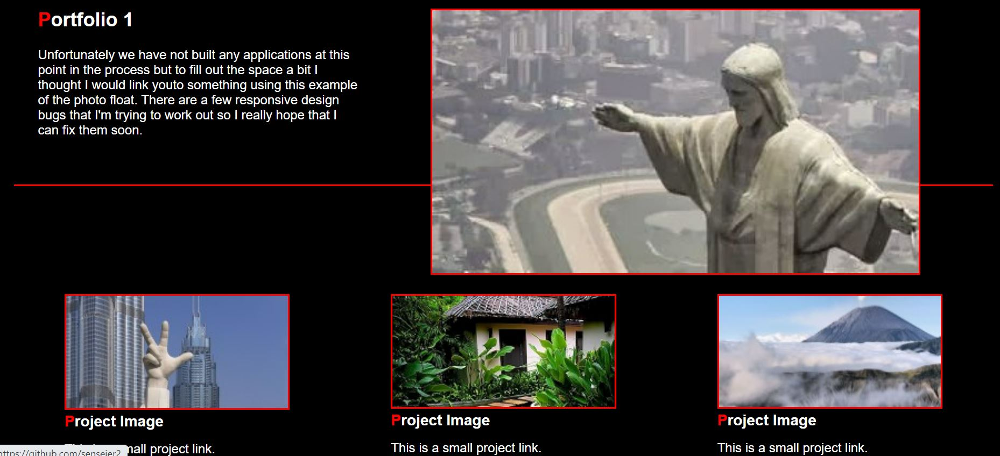

# Portfolio-week02
Portfolio Website

Building a responsive portfolio website for the client that displays their biographical information, Some images that link to a few of their projects, contact information, and their resume.

The menu has some hover elements so that the colors transition a bit to highlight user input.

Here is a screenshot of the overall page look and feel

